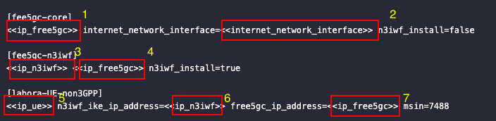
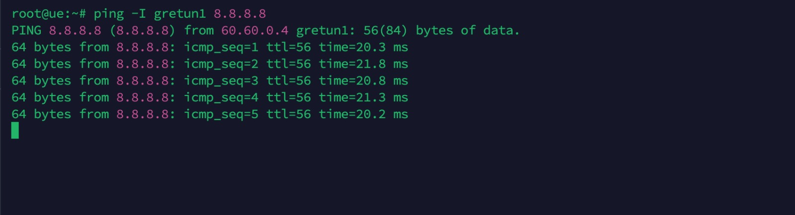
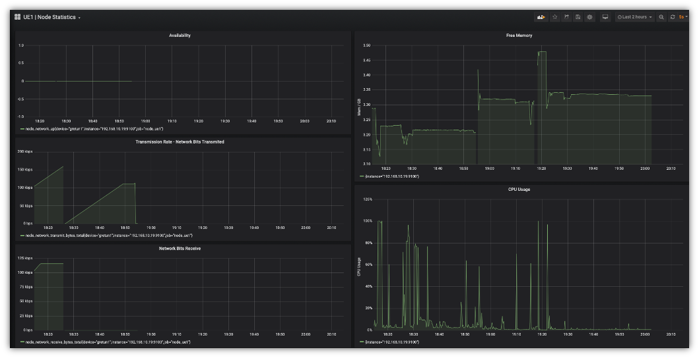

<p float="center">
    
</p>

## Coleta e análise de parâmetros de qualidade de serviço em sessões de dados de uma rede 5G utilizando Prometheus, Grafana e NWDAF

O tutorial foi baseado no ambiente divulgado pelo Ciro Macedo no vídeo disponível em https://github.com/ciromacedo/UE-non3GPP-v1 e gravado em vídeo em https://youtu.be/UswQTnTZGt4

# Introdução 
Este trabalho tem como objetivo coletar os parâmetros de qualidade de serviço (Quality of Service - QoS) de sessões de equipamentos de usuário (User Equipment - UE) em uma rede 5G utilizando o software Prometheus conectado ao túnel GTP e a função NWDAF (Função de Análise de Dados de Rede).

# Ambiente
Ambiente necessita de 6 máquinas para funcionar. O ambiente foi desenvolvido na AWS. Ao acessar deve-se criar 6 máquinas com os seguintes nomes e requisitos abaixo:
    - Máquina 1: free5GC
    - Máquina 2: N3IWF
    - Máquina 3: UE
    - Máquina 3: UE 2
    - Máquina 5: Máquina do Operador (openinstallcc)
    - Máquina 6: Prometheus e Grafana

SO: Ubuntu 20.04 (LTS) x64
Uname -r: 5.4.0-122-generic
Memory: 4 GB
Disk: 80 GB

Utilizado gerenciador de acesso remoto do VS Code para acessar as máquinas

# Permitir acesso a pasta AWS
Para liberar acesso ao gerenciamento de pastas caso utilizar um gerenciador de ssh deve permitir acesso ao usuário atual para editar as pastas, neste caso o usuário é ubuntu
```
sudo chown -R ubuntu /home/ubuntu/
```

# Instalar bibliotecas necessárias
```
sudo apt update && apt -y install python && sudo apt -y install git && sudo apt -y install ansible && sudo apt -y install net-tools
```

# Clone do projeto na máquina do operador (neste projeto openinstallcc)
```
apt update && git clone https://github.com/LABORA-INF-UFG/UE-non3GPP.git 
```

# Editar IP das máquinas no arquivo de conexão de hosts
Editar o arquivo em UE-non3GPP/dev/free5gc-v3.1.1/hosts e editar os IP's das máquinas de acesso e a interface de rede da máquina com o core através do comando abaixo no terminal linux e verificar qual nome da interface que faz conexão com a internet

```
ifconfig
```
A configuração do arquivo hosts deve ser feito da seguinte forma:

1: Colocar ip da máquina com o core (5gc)
2: Colocar a interface de conexão com a internet da máquina que hospeda o core
3: Colocar o ip da máquina com com a NF>n3iwf (n3iwf)
4: Colocar ip da máquina com o core (5gc)
5: Colocar ip da máquina com a UE (uecc)
6: Colocar o ip da máquina com com a NF>n3iwf (n3iwf)
7: Colocar ip da máquina com o core (5gc)

<p float="center">
    
</p>
 O parâmetro "n3iwf_install=true" significa que deve subir o projeto Free5gc apenas com a NF n3iwf, caso seja "false" todas as NF serão habilitadas, exceto a n3iwf

# Habilitar o acesso ssh da máquina do operador para com as demais

Gerar chaves na máquina do operador:
```
ssh-keygen -t ecdsa -b 521
```

Permitir o acesso entre as máquinas, rodando o comando a seguir na máquina openinstallcc (pressionar enter 3x após rodar cada comando)
```
ssh-copy-id -i ~/.ssh/id_ecdsa.pub root@<free5gc-ip-address>
ssh-copy-id -i ~/.ssh/id_ecdsa.pub root@<n3iwf-ip-address>
ssh-copy-id -i ~/.ssh/id_ecdsa.pub root@<uecc-ip-address>
```
Caso o comando acima não funcione, pode ser utilizado o seguinte, para casos de servidor com acesso via chave .pem
```
cat ~/.ssh/id_ecdsa.pub | ssh -i "chave.pem" username@remote_host "mkdir -p ~/.ssh && touch ~/.ssh/authorized_keys && chmod -R go= ~/.ssh && cat >> ~/.ssh/authorized_keys"
```

Teste de acesso de comunicação, lembre-se de liberar o icmp nas máquinas
```
sudo ansible -i ./hosts -m ping all -u ubuntu
```

# Install go
Antes de executar os comandos a seguir do tutorial deve-se verificar o usuário para acesso as máquinas, que por padrão dos scripts está com o root. Para tal deve-se verificar os arquivos:
1. UE-non3GPP/dev/free5gc-v3.1.1/free5gc-n3iwf-setup.yaml linha 4
2. UE-non3GPP/dev/free5gc-v3.1.1/go-install.yaml linha 4
3. UE-non3GPP/dev/UEnon3GPP-setup.yaml linha 4
Após alterar para o usuário de acesso as máquinas, podemos seguir para os demais passos para levantar o ambiente.

Instalando o Go.
```
ansible-playbook dev/free5gc-v3.1.1/go-install.yaml -i dev/free5gc-v3.1.1/hosts
```
Rodar o comando a seguir em cada um dos servers para atualizar as novas bibliotecas
```
source ~/.bashrc
```

# Setup Free5GC
Instalar curl para mongo individualmente em cada máquina
```
sudo apt-get install gnupg curl

curl -fsSL https://pgp.mongodb.com/server-6.0.asc | \
   sudo gpg -o /usr/share/keyrings/mongodb-server-6.0.gpg \
   --dearmor
   
echo "deb [ arch=amd64,arm64 signed-by=/usr/share/keyrings/mongodb-server-6.0.gpg ] https://repo.mongodb.org/apt/ubuntu jammy/mongodb-org/6.0 multiverse" | sudo tee /etc/apt/sources.list.d/mongodb-org-6.0.list

sudo apt-get update
```
Rodar comando seguinte na máquina openinstallcc
```
sudo ansible-playbook dev/free5gc-v3.1.1/free5gc-n3iwf-setup.yaml -i dev/free5gc-v3.1.1/hosts
```

# Setup UE-non3GPP with Ansible 
```
ansible-playbook dev/UEnon3GPP-setup.yaml -i dev/free5gc-v3.1.1/hosts
```
# Demo do ambiente
Com o ambiente online e funcional deve ser possível realizar teste de ping e acesso entre as máquinas, bem como gerar tráfego no túnel GTP, conforme a imagem abaixo.

<p float="center">
    
</p>


# Túnel GTP
O túnel GPRS Tunneling Protocol (GTP) é um túnel de controle que é usado para transportar mensagens de controle entre o núcleo da rede 5G (5GC) e as estações base (eNBs). Essas mensagens são usadas para gerenciar a conexão entre os usuários e a rede, incluindo a autenticação, autorização e configuração de sessão.

O túnel GTP é implementado usando o protocolo GTP, que é um protocolo padrão da indústria para transportar dados de controle em redes móveis. O túnel GTP é criado entre o 5GC e a eNB quando um usuário se conecta à rede. O túnel permanece aberto durante toda a duração da sessão do usuário.

As mensagens de controle que são transportadas pelo túnel GTP incluem:
- Mensagens de autenticação e autorização
- Mensagens de configuração de sessão
- Mensagens de gerenciamento de sessão

# Coleta dos dados com Prometheus e Exibição com Grafana
O Prometheus é um sistema open-source de monitoramento e coleta de dados que ajuda as equipes de operações de TI a coletar métricas sobre seus sistemas e aplicações. Ele faz parte da Cloud Native Computing Foundation (CNCF) e oferece uma solução escalável e flexível para monitorar sistemas complexos. O Grafana é utilizado neste contexto para melhorar a parte visual dos dados obtidos pelo Prometheus. O Prometheus deve ser construido através de uma máquina dedicada, que chamaremos de prometheus_server e em cada máquina a ser monitorado (neste caso as UEs) deve ser instalado o prometheus node_exporter.

Clonar repositório de auxilio para implementação do Prometheus na máquina que será instalado o server
```
git clone https://github.com/in4it/prometheus-course
```
Acessar pasta e utilizar script de instalação com auxilio do arquivo ./1-install.sh
```
cd prometheus/scripts/
./1-install.sh
```
Para coletar os dados dos exporters acessar o arquivo de configuração do prometheus com o seguinte comando
```
nano etc/prometheus/prometheus.yml 
```
Configure o arquivo com o ip do exporter instalado, se for instalado com porta padrão os dados serão enviados pela porta 9100. Já o Prometheus server é acessado através da porta 9090 e pode ser acessado via web.
```
- job_name: 'node_ue1'
    scrape_interval: 5s
    static_configs:
      - targets: ['IP_TARGET:9100']
```

Após será realizada a instalação do node_exporter nas UEs
Clonar repositório de auxilio para implementação do Prometheus na máquina da UE na qual será instalado o exporter
```
git clone https://github.com/in4it/prometheus-course
```
Acessar pasta e utilizar script de instalação com auxilio do arquivo ./2-node-exporter.sh
```
cd prometheus/scripts/
./2-node-exporter.sh
```

Por fim será instalado o Grafana na mesma máquina do Prometheus e conectar ao banco de dados do mesmo
Instalar pré-requisitos
```
sudo apt-get install -y apt-transport-https software-properties-common wget
```
Importar chave GPG
```
sudo mkdir -p /etc/apt/keyrings/
wget -q -O - https://apt.grafana.com/gpg.key | gpg --dearmor | sudo tee /etc/apt/keyrings/grafana.gpg > /dev/null
```
Adicionar repositório estável a lista de pacotes
```
echo "deb [signed-by=/etc/apt/keyrings/grafana.gpg] https://apt.grafana.com stable main" | sudo tee -a /etc/apt/sources.list.d/grafana.list
```
Instalar grafana
```
sudo apt-get update
sudo apt-get install grafana
```
Verificar instalação e se o programa está em execução. O Grafana é executado na porta 3000 e pode ser acessado via web.
```
sudo service grafana-server status
```

Com todas as máquinas instaladas é possível fazer o monitoramento de vários recursos das UEs. O dashboard abaixo demonstra uma view básica criada no Grafana para monitoramento do túnel (gretun1) básica, onde são monitorados recursos de memória e utilização de CPU bem como disponibilidade, upload e download do túnel.

<p float="center">
    
</p>

# NWDAF
A NWDAF é responsável por coletar dados de rede, analisar o desempenho e fornecer insights valiosos para otimizar a qualidade do serviço e à eficiência da rede 5G. Ela usa algoritmos e técnicas avançadas de análise de dados para identificar tendências, detectar anomalias e fornecer recomendações para melhorar o desempenho e a disponibilidade da rede. A NWDAF proporciona diversos benefícios, como o monitoramento em tempo real, a capacidade de predição de problemas e à otimização automática da rede para garantir uma experiência de usuário excepcional.

A NWDAF será inserida na máquina com o core na pasta .go/src/free5gc/openapi/

Instalar NPM
```
sudo apt install nodejs
```
Instalar ferramentas openapi 
```
npm install @openapitools/openapi-generator-cli -g
```
Download petstore.yaml para realizar o teste do apenapi-generator
```
npx @openapitools/openapi-generator-cli generate -i petstore.yaml -g ruby -o /tmp/test/
```

Após o teste bem sucedido podemos iniciar a instalação do yaml do NWDAF

Crie a pasta dentro do free5gc
```
mkdir ./go/src/free5gc/openapi/
```
Clonar arquivo yaml do NWDAF
```
git clone https://github.com/jdegre/5GC_APIs/blob/Rel-18/TS29520_Nnwdaf_AnalyticsInfo.yaml
```
Gerar código da NWDAF a partir do yaml na pasta ./api/Nwdaf_Analytics_Info/
```
sudo openapi-generator-cli generate -i TS29520_Nnwdaf_AnalyticsInfo.yaml -g go --skip-validate-spec -o api/Nwdaf_Analytics_Info/
```
Com os arquivos .go gerados da NWDAF é possível realizar as implementações para coleta dos dados gerador pelo Prometheus

## Iniciar o ambiente das máquinas
Inicializar o Core 
```
cd go/src/free5gc/
./run.sh
```
Inicializar o webconsole para monitoramento das UEs
```
cd go/src/free5gc/webconsole/
go run server.go
```

Inicializar a N3IWF
```
cd go/src/free5gc/NFs/n3iwf/
go run cmd/main.go
```
Inicializar a UE
```
cd go/src/UE-non3GPP/
go run cmd/main.go ue
```

## Conclusão

O ambiente foi construído com todos os requisitos necessários, a coleta de dados do túnel GTP foi possível através do Prometheus e exibidos com auxílio do Grafana, portanto 2/3 das expectativas apresentadas na introdução deste trabalho foram cumpridas. No entanto, a coleta dos dados para a NWDAF, bem como realizar a análise destes dados dentro desta function não foi possível no decorrer deste projeto e continua em processo pelo autor com expectativa de conclusão até 11/12/2023.